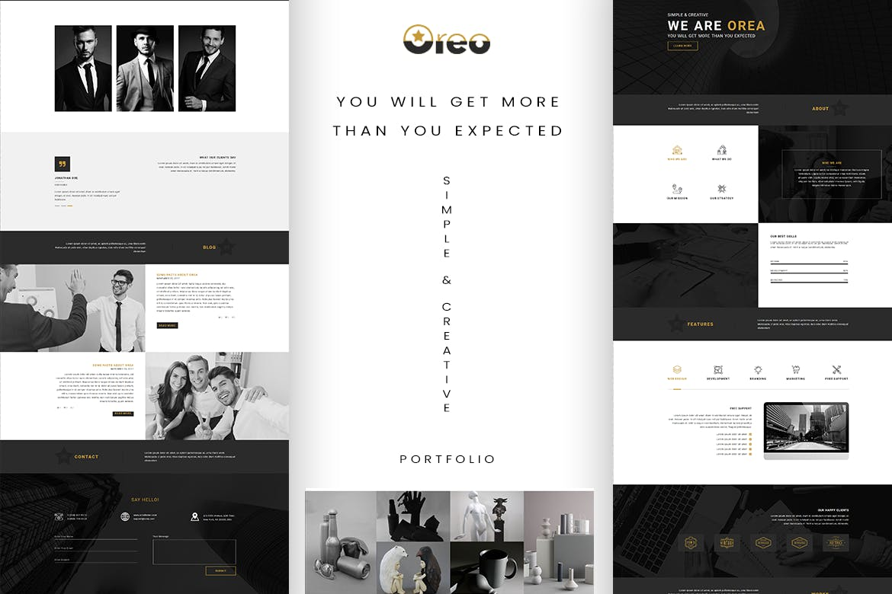
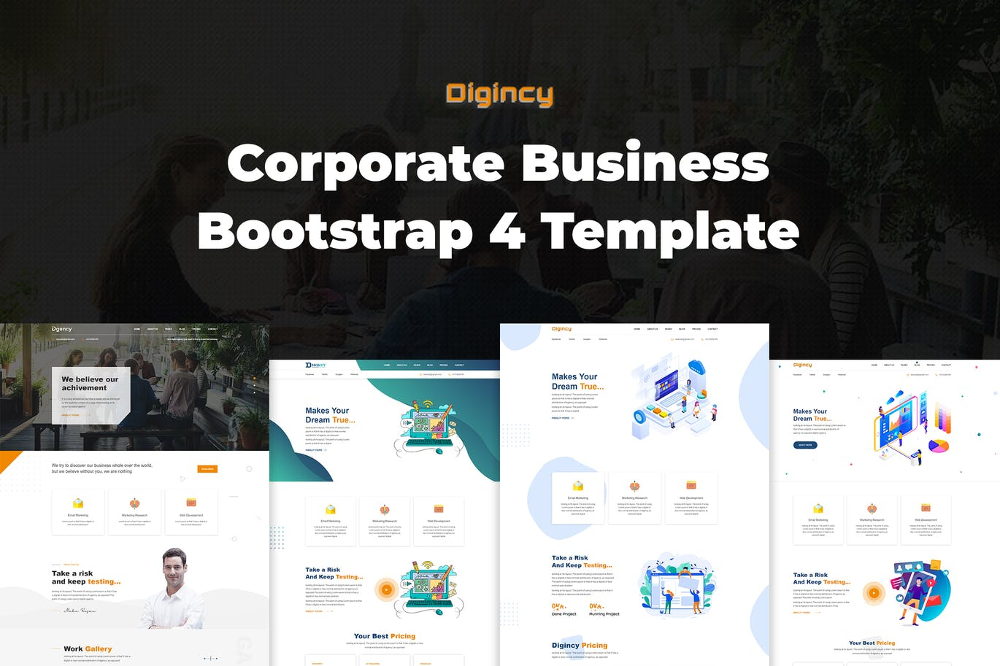
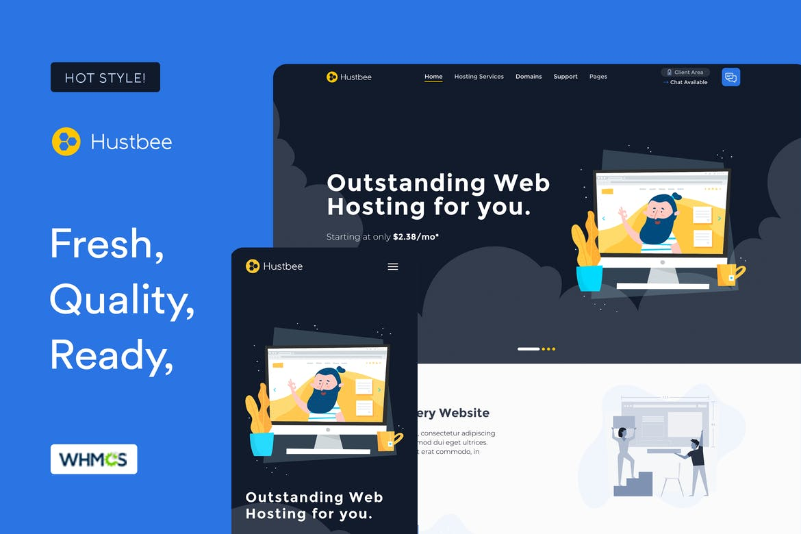

# Theme System For Laravel

Making simple to theme a Laravel application (front-end). 

## Installation
``` composer require simplepleb/themes ```

#### Publish config and working themes using artisan CLI.

~~~
php artisan vendor:publish --provider="SimplePleb\Theme\ThemeServiceProvider"
~~~

## Before Updating Package 
Before you run ``` composer update ``` and if you have edited any of the included themes,
* Duplicate the folder for the edited theme
* Update the theme.json file (theme name and slug) in the new folder.

This is done to avoid the update overwriting your changes with any updates made to the module package.

#### After Package Update: Publish themes library for updates

```
php artisan vendor:publish --tag=themes 
```

## Usage from controller method

~~~php
	// themes included with package hustbee, oreo, more coming
    Theme::uses('hustbee');  // change to the name of your theme
            
    $data['info'] = 'Hello World'; 
    
    return Theme::view('index', $data);

~~~

### Settings

Each theme can add custom settings to Laravel by adding a file ```custom_fields.json``` to the theme's folder. 
These fields generate a complete setting's form within Laravel.

```json
{
    "fields": [
        { "field_name": "home_title", "field_type": "textbox", "field_options": "", "field_help": "", "field_value": "Welcome Home"},
        { "field_name": "footer_text", "field_type": "textarea", "field_options": "", "field_help": "Placed on the bottom of every page", "field_value": "Thanks for visiting"},
        { "field_name": "home_intro", "field_type": "wysiwyg", "field_options": "", "field_help": "", "field_value": "<h1>Thanks for visiting</h1>"},
        { "field_name": "enable_customizer", "field_type": "checkbox", "field_options": "", "field_help": "Show style customizer", "field_value": "Thanks for visiting"},
        { "field_name": "test_select", "field_type": "select2", "field_options": "White,Yellow,Black", "field_help": "Tests the select", "field_value": "White"}
    ]

}
```


### Custom Menus

Themes can make footer or other ```<ul>``` lists easy to modify by adding menus to the file ```custom_fields.json```

```json 
"menus": [
        { "menu_name":  "hustbee_footer_1", "menu_class":  "", "links": [
            { "title": "About Us", "url": "/about_us", "li_class": "", "link_class": "", "parent": 0, "order": 0 },
            { "title": "Press & Media", "url": "/press-media", "li_class": "", "link_class": "", "parent": 0, "order": 0 },
            { "title": "News & Blog", "url": "/blog", "li_class": "", "link_class": "", "parent": 0, "order": 0 } ,
            { "title": "Contact Us", "url": "/contact-us", "li_class": "", "link_class": "", "parent": 0, "order": 0 },
            { "title": "Careers", "url": "/careers", "li_class": "", "link_class": "", "parent": 0, "order": 0 }
        ] },
        { "menu_name":  "hustbee_footer_2", "menu_class":  "nav navbar-nav navbar-nav-centered", "links": [
            { "title": "About Us", "url": "/about_us", "li_class": "nav-item", "link_class": "nav-link", "parent": 0, "order": 0  },
            { "title": "Press & Media", "url": "/press-media", "li_class": "nav-item", "link_class": "nav-link", "parent": 0, "order": 0  }
        ] }
    ]
```

For a complete example take a look at the theme 'hustbee' which has these features enabled. For an 
easier way to manage menus and make them easily edited and managed. Take a look at the [Menu Maker Module](https://github.com/simplepleb/menumaker-module).


### Screenshots Of Sample Themes

Oreo



Digincy



Hustbee




### References

- [Based On Teeplus/Laravel-Theme](https://github.com/teepluss/laravel-theme)